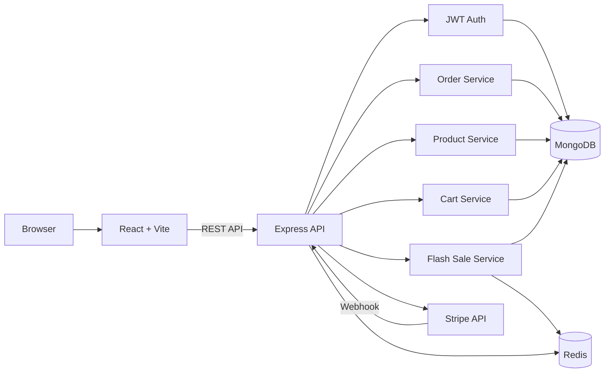
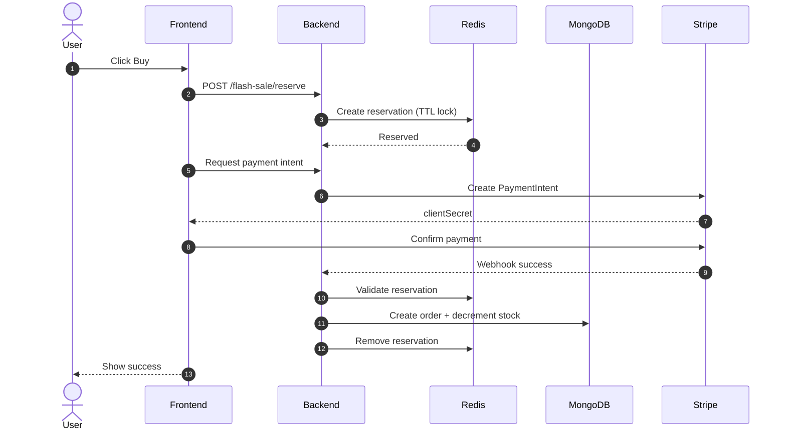

# Flash Sale E-Commerce System

High-performance flash sale platform designed to handle extreme concurrency, prevent overselling, and ensure secure, consistent purchases.

---

# Architecture Diagram



---

# Flash Sale Purchase Sequence



---

# System Overview

## Frontend (React + Vite)

Responsibilities:

* Authentication
* Product browsing
* Flash sale interaction
* Checkout flow
* JWT token storage

Communicates with backend via REST API.

---

## Backend (Node.js + Express)

Responsibilities:

* Authentication (JWT)
* Flash sale orchestration
* Reservation management
* Order creation
* Payment processing
* Rate limiting
* Webhook handling

Stateless and horizontally scalable.

---

## MongoDB (Persistent Storage)

Stores:

```
Users
Products
Orders
Cart
Flash Sale state
```

Role:

Source of truth for all permanent data.

---

## Redis (Concurrency Control Layer)

Stores:

```
Flash sale reservations
Stock locks
Rate limiting counters
```

Purpose:

Prevents overselling during high concurrency.

---

## Stripe (Payment Processor)

Handles:

```
Payment processing
Payment validation
Webhook confirmation
```

Orders only confirmed after webhook verification.

---

# Flash Sale Design

Uses reservation-based purchase model:

```
Reserve → Pay → Confirm → Finalize
```

Guarantees:

* No overselling
* Atomic purchase flow
* Fast reservation
* Payment-verified order creation

Redis ensures reservation safety before MongoDB update.

---

# Authentication Design

Uses JWT:

```
Access Token → short-lived
Refresh Token → long-lived
```

Frontend sends:

```
Authorization: Bearer <token>
```

Backend verifies via middleware.

Enables stateless horizontal scaling.

---

# Key Design Decisions & Tradeoffs

## Redis Reservation Layer

Decision: Redis handles reservation before DB write.

Benefit:

Prevents overselling.

Tradeoff:

Additional infrastructure complexity.

---

## JWT Authentication

Decision: Stateless JWT auth.

Benefit:

Scalable, no session storage required.

Tradeoff:

Token revocation requires additional handling.

---

## MongoDB as Primary Database

Decision: MongoDB for core data.

Benefit:

Flexible schema, scalable.

Tradeoff:

Less strict relational guarantees vs SQL.

---

## Webhook-based Payment Confirmation

Decision: Confirm orders via Stripe webhook only.

Benefit:

Prevents fake or incomplete orders.

Tradeoff:

More complex event handling.

---

## Rate Limiting

Decision: API rate limiting enabled.

Benefit:

Protects system during flash sale spikes.

Tradeoff:

May reject excessive client bursts.

---

# Scalability Characteristics

Supports:

```
High concurrency purchase traffic
Horizontal backend scaling
Stateless authentication
Fast reservation handling
Safe stock management
```

Redis ensures atomic reservation safety.

---

# Project Structure

```
frontend/
backend/
  src/
    controllers/
    models/
    middleware/
    routes/
    config/
```

---

# Security Features

* JWT authentication
* Password hashing (bcrypt)
* Stripe webhook verification
* Rate limiting
* Secure token handling

---

# Summary

This architecture ensures:

* No overselling
* High concurrency safety
* Secure payment confirmation
* Horizontal scalability
* Reliable flash sale execution

Designed specifically for high-traffic flash sale scenarios.
