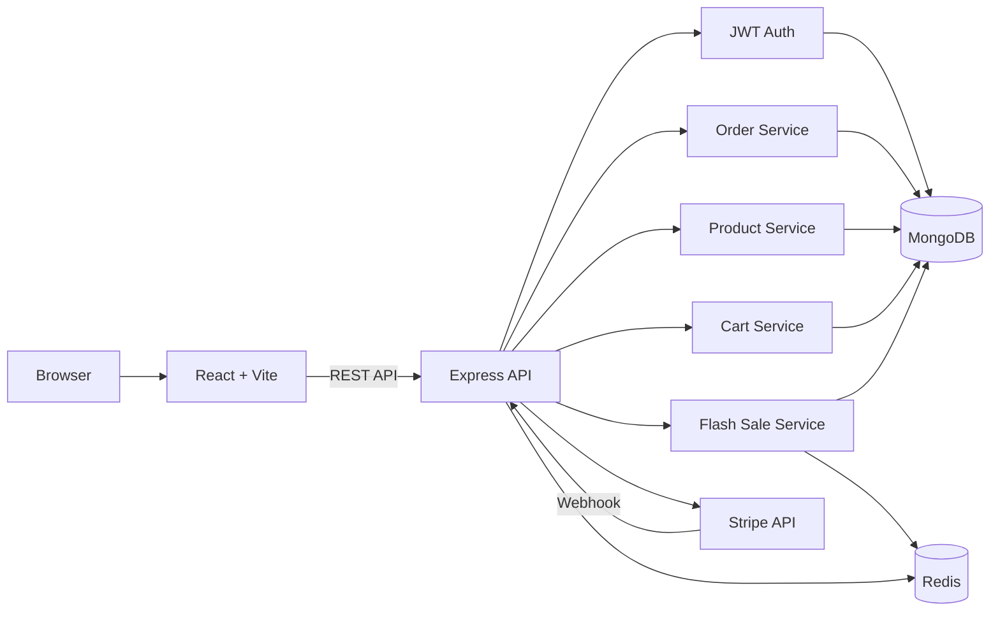
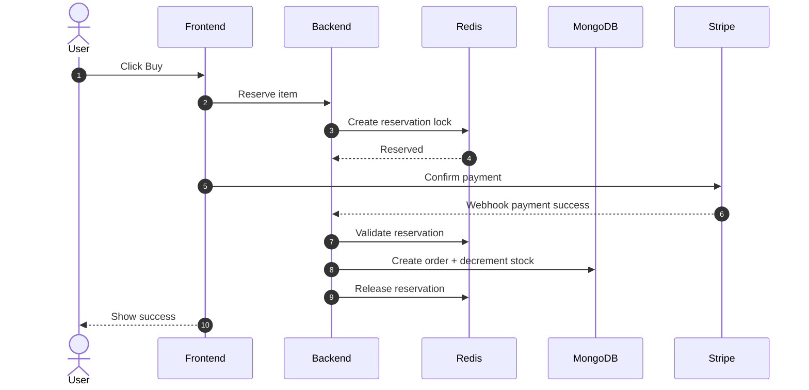

# Flash Sale E-Commerce System

High-performance flash sale platform designed to handle extreme concurrency, prevent overselling, and ensure secure, consistent purchases.

---

# Architecture Diagram



---

# Flash Sale Purchase Sequence



---

# System Overview

Frontend: React + Vite
Backend: Node.js + Express
Database: MongoDB
Concurrency control: Redis
Payments: Stripe
Authentication: JWT

MongoDB stores persistent data.
Redis handles high-speed reservations and locking.

---

# Flash Sale Design

Reservation-based model:
Reserve → Pay → Confirm → Finalize

Redis prevents concurrent overselling.
MongoDB ensures durable storage.

---

# Authentication

JWT stateless authentication.
Frontend sends:
Authorization: Bearer <accessToken>
Backend validates via middleware.

---

# Local Setup Instructions

## Prerequisites

* Node.js 18+
* MongoDB running
* Redis running
* Stripe account (for payment testing)

---

## Backend setup

```bash
cd backend
npm install
```

Create:

```
backend/.env
```

```env
PORT=3000
NODE_ENV=development

MONGODB_URI=mongodb://127.0.0.1:27017/flash_sale_db

USE_MOCK_REDIS=true

STRIPE_SECRET_KEY=xxxx
STRIPE_WEBHOOK_SECRET=xxxxx

JWT_ACCESS_SECRET=<generate>
JWT_REFRESH_SECRET=<generate>
JWT_ACCESS_EXPIRES_IN=15m
JWT_REFRESH_EXPIRES_IN=30d
```

Generate secrets:

```bash
node -e "console.log(require('crypto').randomBytes(64).toString('hex'))"
```

Run backend:

```bash
npm run dev
```

---

## Frontend setup

```bash
cd frontend
npm install
npm run dev
```

Create:

```
frontend/.env
```

```env
VITE_STRIPE_PUBLISHABLE_KEY=pk_test_xxxx
VITE_API_URL=http://localhost:3000
```

Open:

```
http://localhost:5173
```

---

# Stress Test Instructions

Install k6:

```bash
brew install k6
```

Example stress test:

```bash
k6 run stress/k6-reserve.js
```

Example configuration:

```js
export const options = {
  vus: 200,
  duration: "30s",
};
```

This simulates 200 concurrent users.

---

# Expected Stress Test Outcome (IMPORTANT)

When stress testing flash sale reservations, the system MUST demonstrate correctness and stability.

## Correctness expectations

Assume:

```
Product stock = 100
Concurrent users = 200
```

Expected result:

```
Successful reservations: 100
Failed reservations: 100
```

Never:

```
Successful reservations > stock
Stock < 0
Duplicate successful reservations
```

Redis ensures atomic reservation locking.
This proves overselling protection works.

---

## Performance expectations

Under load (example: 200 concurrent users):

Typical expected metrics:

```
Error rate: near 0% (excluding expected reservation failures)
Latency (p95): < 200ms
Latency (p99): < 400ms
Server crashes: none
Memory leaks: none
```

Reservation failures are normal and expected once stock is exhausted.

These are NOT system errors.

---

## System stability expectations

System must remain:

* responsive
* consistent
* stable

Even when demand exceeds supply.

Backend must not:

* crash
* oversell
* corrupt stock data

---

## Database correctness expectations
After test completes:
MongoDB must show:

```
Total orders = initial stock
Remaining stock = 0
```

Never negative.

---

## Redis correctness expectations
Redis must:
* properly create reservation locks
* release locks after confirm/cancel
* never allow duplicate reservation

---

# What This Stress Test Proves

This confirms system guarantees:
* concurrency safety
* oversell prevention
* atomic reservation logic
* scalability readiness

This validates production-grade flash sale architecture.

---

# Design Tradeoffs (concise)

Redis reservation layer

Benefit:
Prevents oversell

Tradeoff:
Additional infrastructure complexity

---

JWT stateless auth

Benefit:
Horizontally scalable

Tradeoff:
Token revocation requires extra handling

---

MongoDB flexible schema

Benefit:
Scalable and fast iteration

Tradeoff:
Less strict relational guarantees vs SQL

---

Webhook-based order confirmation

Benefit:
Payment correctness guaranteed

Tradeoff:
Async handling complexity

---

# Project Structure

```
frontend/
  src/
    assets/
    components/
    pages/
    services/
    App.css
    App.tsx
    index.css
    main.tsx
backend/
  src/
    config/
    controllers/
    middleware/
    models/
    routes/
    scripts/
    services/
    types/
    utils/
    server.ts
```

---

# Summary

This system provides:

* concurrency-safe flash sale execution
* oversell protection
* high scalability
* secure payment verification
* production-grade architecture

Redis ensures correctness under extreme load.
MongoDB ensures durability.
JWT ensures scalable authentication.

This architecture is suitable for high-traffic flash sale environments.
